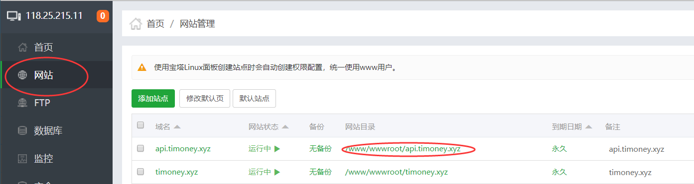
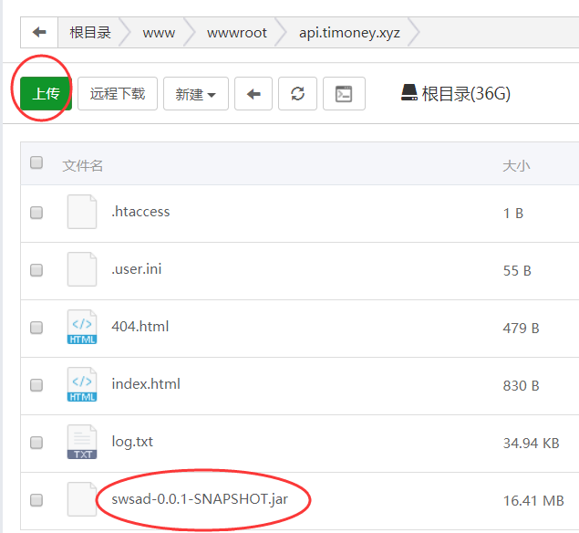
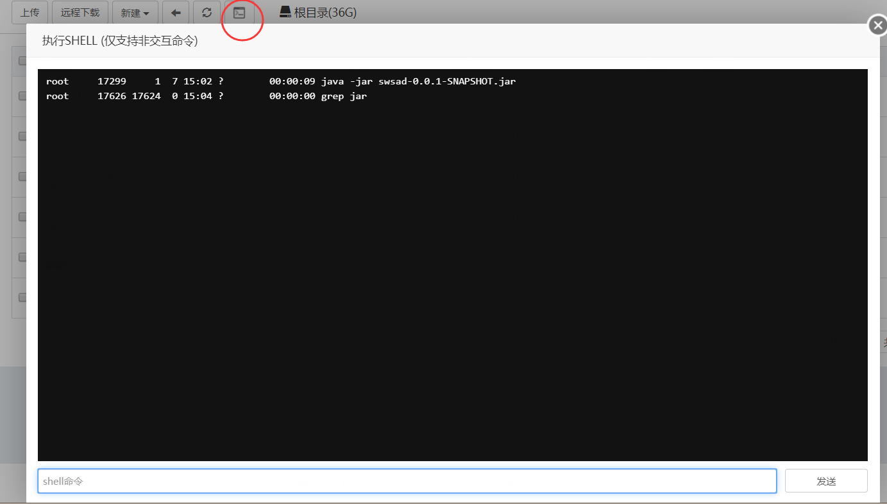
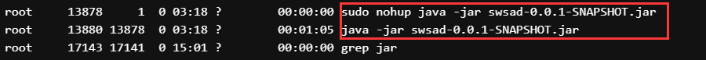
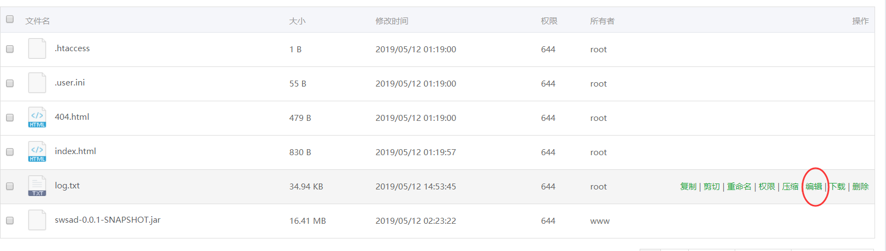

## 开发环境

**IntelliJ Idea + Java 1.8.0 + Spring Boot + MySQL5.5(服务器上) + Tomcat(9.0)(可选)** 

- 直接将项目导入为`IntelliJ`项目，点击运行

- 服务器数据库地址为 jdbc:mysql://localhost:3306/swsad
  
  (直接在本地数据库调试)
  
  用户名:swsad

  密码:swsad

- 测试`url`为 http://localhost:8080

## 部署环境

**Java 1.8.0**

- 使用`IDEA maven`的`package`命令打包生成`jar`包

  位于`system-design\backend\target`目录下

- 登录网站面板[http://118.25.215.11:8888](http://118.25.215.11:8888/)

- 选择网站->`api.timoney.xyz`->`网站目录`

  

  **注意：只要修改api.timoney.xyz和timemoney.xyz就好了，不要修改其他网站啊（因为是别人的服务器)**

- 上传本地jar

  

- 使用`linux`方式运行`jar`包

  ```bash
  //windows
  $ java -jar .\swsad-0.0.1-SNAPSHOT.jar 
  //linux 持续运行，输出日志到log.txt，每次运行日志会清空
  $ nohup java -jar swsad-0.0.1-SNAPSHOT.jar > log.txt &
  ```
  
  红圈指示地方为命令行入口
  
  
  
- 查看后台jar包

```bash
  $ ps -def | grep jar
  $ kill 进程号
```

**每次运行新的jar包一定要查看一下后台jar包运行情况，kill掉之前的jar包再运行！**

**kill掉第一个和第二个，第三个不用kill!**

**如下图，进程号为13878和13880**



- 查看日志

  选择**log.txt点编辑**就好了

  **所以要求写代码的时候除了返回给前端，还有多输出一些调试信息，方便查错误，用`System.out.println()`就可以了**



> 为什么api.timoney.xyz可以监听8080端口，这是对网站的nginx做了配置，不用管就好

## API文档

[API详细文档](https://documenter.getpostman.com/view/7006450/S1LzynKU?version=latest)

> 但是服务器的API不一定是最新的

## 资料

- IDEA 打包Spring项目

  <https://blog.csdn.net/qq_34409900/article/details/80561277>

- IDEA 创建一个Restful的Spring Boot项目

  <https://blog.csdn.net/qq_18297675/article/details/79407438>

- 服务器部署jar包

  <https://blog.csdn.net/qq_39507276/article/details/82227416>

- Spring项目绑定域名

  <https://cloud.tencent.com/developer/article/1332603>

- 安装MySQL

  <https://blog.csdn.net/qq_38683692/article/details/82859141>

- MySQL语法

  <http://www.runoob.com/mysql/mysql-create-tables.html>

- MySQL8使用JDBC连接的问题(但是服务器用不了版本8)

  <https://blog.csdn.net/qq_22076345/article/details/81952035>
  
- 升级java 1.8

  <https://www.jianshu.com/p/848b06dd19aa>
  
- JDBC连接闲置太旧报错
  <https://blog.csdn.net/huanggang028/article/details/44646387>

## 笔记

保存`jar`文件的`ignore`

```
target/classes
target/generated-sources
target/generated-test-sources
target/maven-archiver
target/maven-archiver
target/maven-archiver
target/test-classes
```

