# 软件设计文档（SD）

## 一、技术选型

### 1. 跨平台性

#### 1.1 vue跨平台性

目前前端框架纷繁复杂，针对跨平台性对比，我们可以参见下图

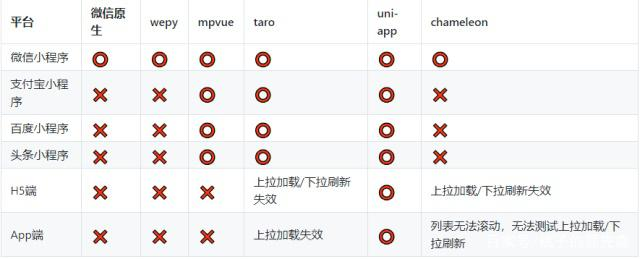

（源自网络）

我们可以发现，对于跨平台需求，uni-app具有最优越的性质，其次则是taro和mpvue，而uni-app和mpvue均为基于vue开发的前端框架，所以使用vue项目进行前端开发时，进行项目迁移是较为简单的。

#### 1.2 js跨平台性

JavaScript一种直译式脚本语言，是一种动态类型、弱类型、基于原型的语言，内置支持类型。它的解释器被称为JavaScript引擎，为浏览器的一部分，广泛用于客户端的脚本语言，最早是在HTML（标准通用标记语言下的一个应用）网页上使用，用来给HTML网页增加动态功能。在1995年时，由Netscape公司的BrendanEich，在网景导航者浏览器上首次设计实现而成。因为Netscape与Sun合作，Netscape管理层希望它外观看起来像Java，因此取名为JavaScript。但实际上它的语法风格与Self及Scheme较为接近。为了取得技术优势，微软推出了JScript，CEnvi推出ScriptEase，与JavaScript同样可在浏览器上运行。为了统一规格，因为JavaScript兼容于ECMA标准，因此也称为ECMAScript。

#### 1.3 java跨平台性

Java语言本身较为特殊，虽然需要编译，但是没有直接编译成机器语言，而是编译成为.class的字节码文件。然后通过Jvm的解释器进行解释执行。在Windows系统上运行，则通Windows上的Jvm进行解释，而在Linux系统上，则通过Linux上的Jvm解释执行。所以Java跨平台,需要保证有相匹配的Jvm，如果没有，则不能进行跨平台。

### 2. 技术选型理由

**Spring Boot**!

- 什么是`SpringBoot`

  在使用传统的`Spring`去做Java EE（Java Enterprise Edition）开发中，大量的 XML 文件存在于项目之中，导致`JavaEE`项目变得慢慢笨重起来，，繁琐的配置和整合第三方框架的配置，导致了开发和部署效率的降低。

  Spring Boot 并不是用来替代 Spring 的解决方案，而是和 Spring 框架紧密结合用于提升 Spring 开发者体验的工具。同时它集成了大量常用的第三方库配置，Spring Boot应用中这些第三方库几乎可以是零配置的开箱即用（out-of-the-box），大部分的 Spring Boot 应用都只需要非常少量的配置代码（基于 Java 的配置），开发者能够更加专注于业务逻辑。

- 优点

  - 从官方来看

    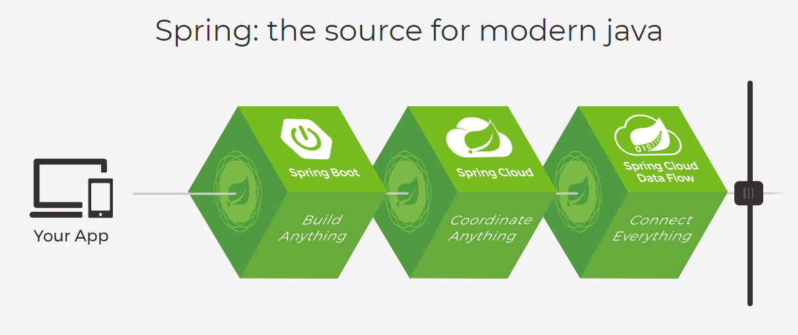

  - 从`Spring`的优点来看

    - **良好的基因**

      因为`SpringBoot`是伴随着Spring 4.0而生的，boot是引导的意思，也就是它的作用其实就是在于帮助开发者快速的搭建Spring框架，因此`SpringBoot`继承了Spring优秀的基因，在Spring中开发更为方便快捷

    - **简化编码**

      比如我们要创建一个 web 项目，使用 Spring 的朋友都知道，在使用 Spring 的时候，需要在 pom 文件中添加多个依赖，而 Spring Boot 则会帮助开发着快速启动一个 web 容器，在 Spring Boot 中，我们只需要在 `pom` 文件中添加如下一个 `starter-web` 依赖即可。

    - **简化配置**

      `Spring` 虽然使`Java EE`轻量级框架，但由于其繁琐的配置，一度被人认为是“配置地狱”。各种XML、Annotation配置会让人眼花缭乱，而且配置多的话，如果出错了也很难找出原因。Spring Boot更多的是采用 Java Config 的方式，对 Spring 进行配置。

    - **简化部署**
      
    
    在使用 Spring 时，项目部署时需要我们在服务器上部署 tomcat，然后把项目打成 war 包扔到 tomcat里，在使用 Spring Boot 后，我们不需要在服务器上去部署 tomcat，因为 Spring Boot 内嵌了 tomcat，我们只需要将项目打成 jar 包，使用 java -jar xxx.jar一键式启动项目。
    
    另外，也降低对运行环境的基本要求，环境变量中有JDK即可。
  
- **简化监控**
  
  我们可以引入 spring-boot-start-actuator 依赖，直接使用 REST 方式来获取进程的运行期性能参数，从而达到监控的目的，比较方便。但是 Spring Boot 只是个微框架，没有提供相应的服务发现与注册的配套功能，没有外围监控集成方案，没有外围安全管理方案，所以在微服务架构中，还需要 Spring Cloud 来配合一起使用。
  
- **从未来发展趋势看**
  
  微服务是未来发展的趋势，项目会从传统架构慢慢转向微服务架构，因为微服务可以使不同的团队专注于更小范围的工作职责、使用独立的技术、更安全更频繁地部署。而 继承了 Spring 的优良特性，与 Spring 一脉相承，而且 支持各种REST API 的实现方式。Spring Boot 也是官方大力推荐的技术，可以看出，Spring Boot 是未来发展的一个大趋势。

## 二、架构设计

### 1. 前端架构设计

- 技术栈

  **vue 2.9.6 + vuex 2.0.0 + axios + iview**

- 开发环境

  **nodejs 8.12.0 + vue-cli  2.9.6**

### 2. 后端架构设计

- 技术栈

  **Java 1.8.0 + Spring Boot + MySQL5.5 + MyBatis**

- 开发环境

  **IntelliJ Idea + Java 1.8.0 + Spring Boot + MySQL5.5(服务器上)** 

- 部署环境

  **Java 1.8.0 + MySQL5.5+ Tomcat(9.0)(内嵌)**

#### 2.1 Spring Boot架构

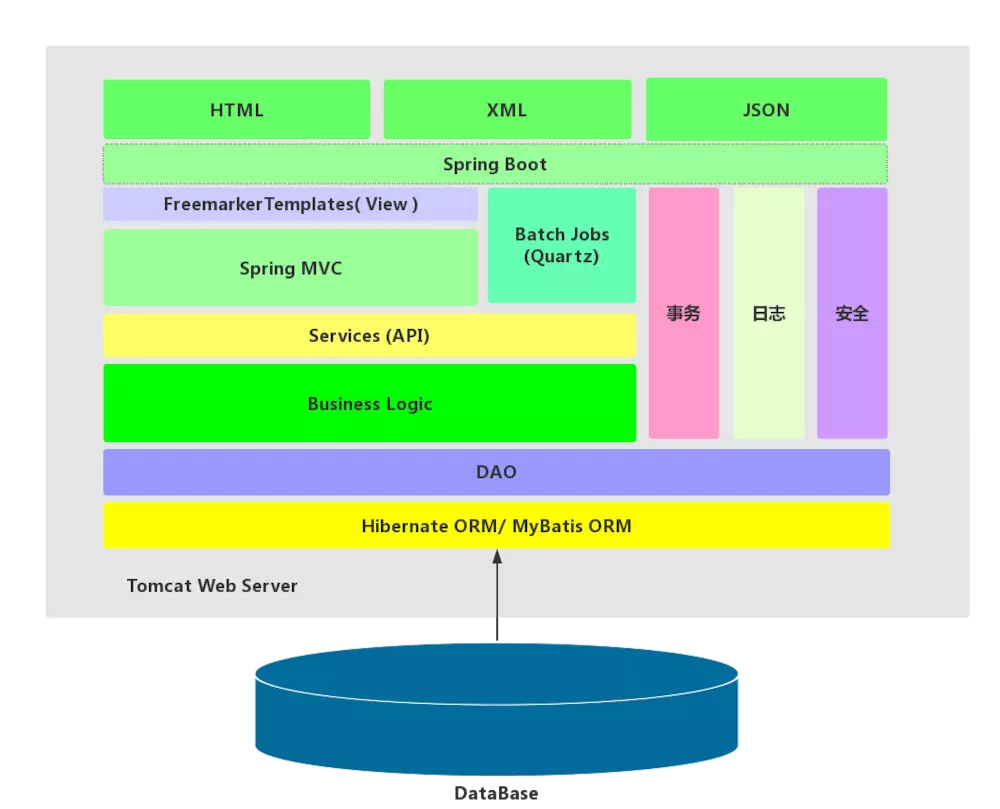

#### 2.2 MyBatis架构

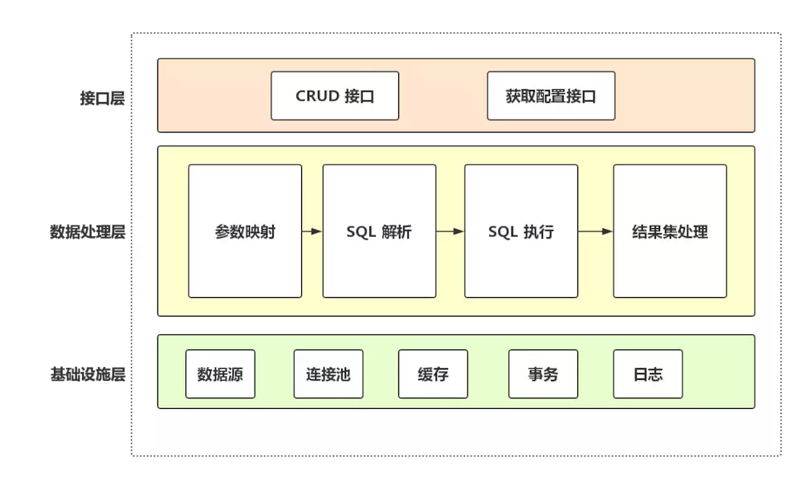

#### 2.3 MyBatis运行流程

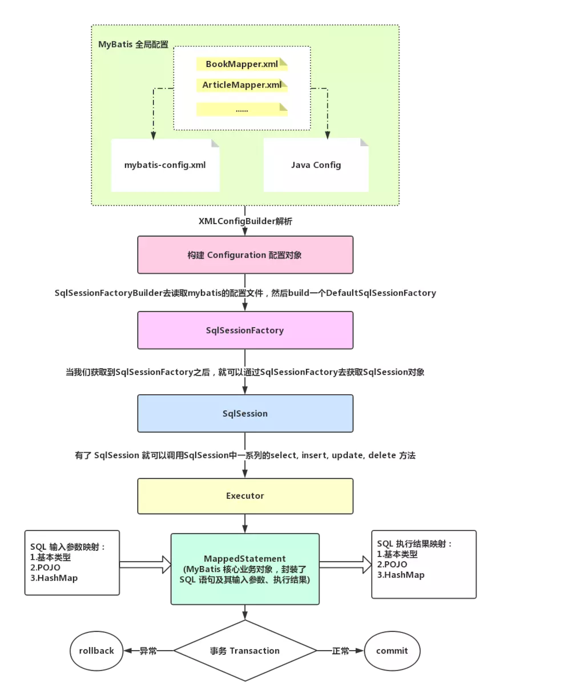

### 3. 逻辑视图

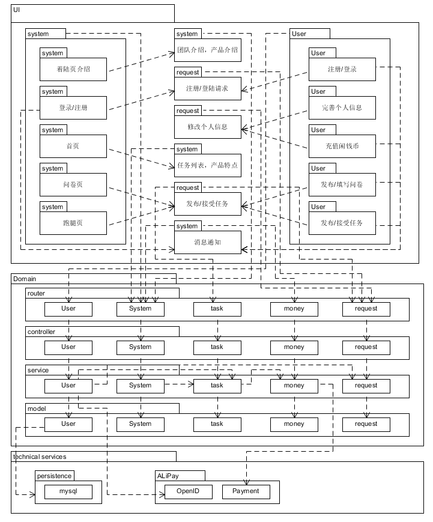

### 4. 物理视图

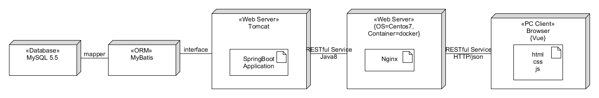

### 5. 开发视图

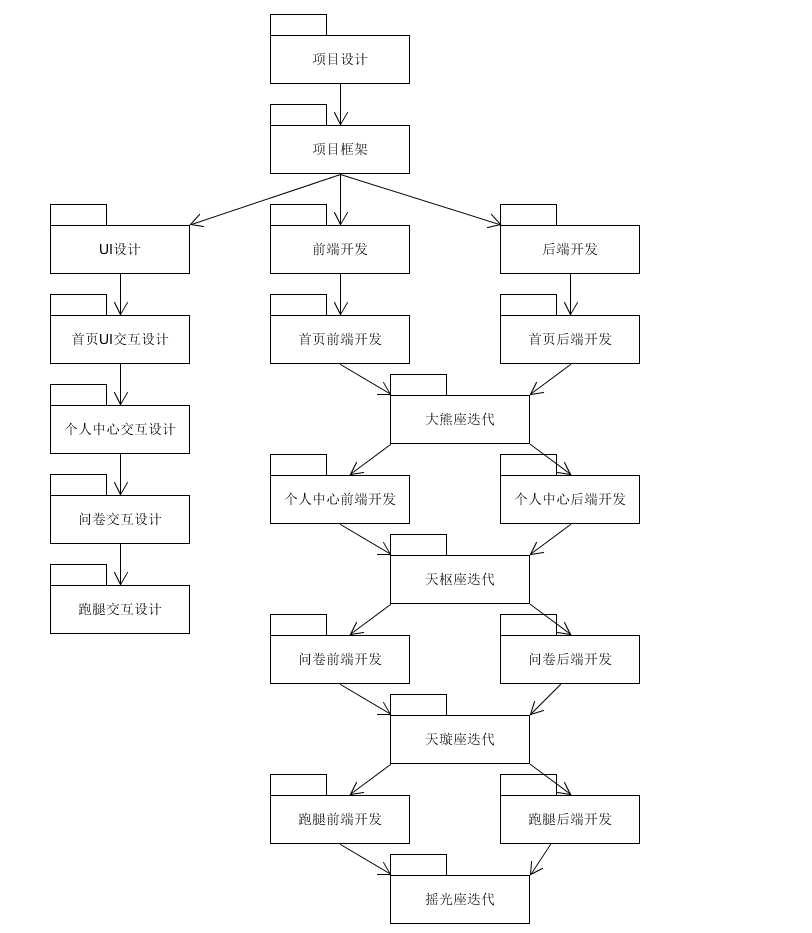

### 6. 处理视图

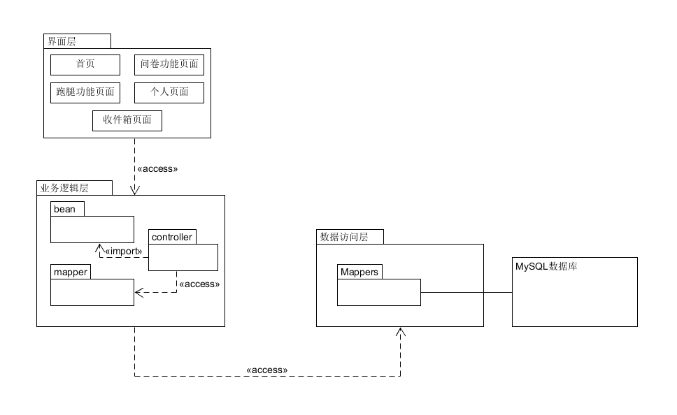

## 三、模块划分

### 1. 前端

```
├─src
   ├─api
   │  │  user.js // 用户权限api
   │  │  system.js // 系统使用api
   │  │  question.js // 问卷模块api
   │  │  personal.js // 个人中心api
   │  │  errands.js // 跑腿模块api
   ├─common
   ├─config
   ├─images
   │  ├─personal
   │  ├─questionaire
   │  ├─redNav
   │  ├─run
   │  └─whiteNav
   ├─libs
   ├─router
   │  │  router.js // 项目路由全局设置
   ├─store
   │  ├─home
   │  	 |		action.js // store->dispatch
   │  	 |		index.js // store->state 首页数据
   │  	 |		getter.js
   │  	 |		mutations.js // store->commit
   │  ├─personal
   │  	 |		action.js // store->dispatch
   │  	 |		index.js // store->state 个人信息数据
   │  	 |		getter.js
   │  	 |		mutations.js // store->commit
   │  ├─questionnaire
   │  │  ├─check
   │  	 |    |		check.js // 查看问卷参与情况缓存
   │  │  └─fill
   │  	 |    |		fill.js // 填写问卷缓存
   │  	 |		action.js // store->dispatch
   │  	 |		index.js // store->state 问卷数据
   │  	 |		getter.js
   │  	 |		mutations.js // store->commit
   │  └─runFavor
   │  	 |		action.js // store->dispatch
   │  	 |		index.js // store->state 跑腿数据
   │  	 |		getter.js
   │  	 |		mutations.js // store->commit
   │  |		action.js // store->dispatch
   │  |		index.js // store->state 系统设置 
   │  |		getter.js
   │  |		mutations.js // store->commit
   ├─styles
   ├─template
   ├─util
   └─views
      ├─components // 组件
      |	|	Detail.vue
      |	|	IdentifyFromAPI.vue
      |	|	IdentifyFromLocal.vue
      |	|	Run.vue
      |	|	RunDetail.vue
      |	|	Task.vue
      ├─createFavor // 创建跑腿系列页面
      |	|	Pay.vue
      |	|	SetFavor.vue
      |	|	Success.vue
      ├─createQues // 创建问卷系列页面
      |	|	EditQues.vue
      |	|	Pay.vue
      |	|	SetQues.vue
      |	|	Success.vue
      ├─navs
      └─Personal
      |		Sign.vue // 注册登录
      |		RunFavor.vue // 跑腿主界面
      |		ReceiveBox.ve // 通知主界面
      |		Questionnaire.vue // 问卷主界面
      |		Publish.vue // 我的发布
      |		Personal.vue // 账户信息界面
      |		Main.vue // nav导航
      |		Jump.vue // 着陆页
      |		Home.vue // 首页主界面
      |		FillingQues.vue // 填写问卷页面
      |		CreateQues.vue // 创建问卷导航页
      |		CraeteFavor.vue // 创建跑腿导航页
      |		Collect.vue // 我的收藏
      |		CheckList.vue // 查看参与/填写情况
      |		Attend.vue // 我参与的
      |		Account.vue // 余额查询界面
```

### 2. 后端

```
├─java
│  ├─META-INF	//java配置文件
│  │      MANIFEST.MF
│  │      
│  └─xyz
│      └─timoney
│          └─swsad	//运行入口
│              │  SwsadApplication.java
│              │  
│              ├─bean	//java类对象
│              │  │  Message.java	//同一返回消息格式
│              │  │  MoneyRecord.java	//交易记录
│              │  │  Util.java	//工具类
│              │  │  
│              │  ├─errands	//跑腿类对象
│              │  │      Errands.java	
│              │  │      Errands_temp.java
│              │  │      Participant.java
│              │  │      Participant_temp.java
│              │  │      
│              │  ├─questionnaire	//问卷类对象
│              │  │      Infos.java
│              │  │      Ques1.java
│              │  │      Ques2.java
│              │  │      Ques2_temp.java
│              │  │      QuesContent.java
│              │  │      QuesResult.java
│              │  │      QuesResult_temp.java
│              │  │      Questionnaire.java
│              │  │      Questionnaire_temp.java
│              │  │      User_temp.java
│              │  │      
│              │  ├─quesUser	//问卷与用户的关系对象
│              │  │      QuesCollectUser.java	//问卷和用户收藏的关系
│              │  │      QuesFillUser.java	//问卷和用户填写的关系
│              │  │      
│              │  └─user	//用户对象
│              │          Code.java		//验证码
│              │          Converter.java	
│              │          Notification.java	//通知对象
│              │          User.java	//用户
│              │          UserState.java	//用户状态，主要是cookie验证
│              │          
│              ├─config	//服务器配置
│              │      WebConfig.java
│              │      
│              ├─controller	//api路由
│              │      Controller.java     //全局API
│              │      ErrandsController.java    //跑腿API
│              │      MoneyController.java      //交易与余额API
│              │      NotificationController.java     //通知API
│              │      QuestionnaireController.java    //问卷API
│              │      UserController.java     //用户API
│              │      VerifyCodeController.java   //验证码API
│              │      
│              ├─Exception	//自定义异常
│              │      GlobalExceptionHandler.java
│              │      MyException.java
│              │      
│              ├─intercepter	//自定义拦截器
│              │      CookieIntercepter.java
│              │      
│              ├─mapper	//mytatis的interface
│              │      ErrandsMapper.java
│              │      MoneyMapper.java
│              │      NotificationMapper.java
│              │      QuesCollectUserMapper.java
│              │      QuesFillUserMapper.java
│              │      QuestionnaireMapper.java
│              │      UserMapper.java
│              │      
│              ├─service	//一些比较有用的工具服务
│              │      Email.java		//发邮件的功能实现
│              │      JwtHelper.java	//session控制
│              │      SMS.java		//发短信功能实现
│              │      
│              └─singleton	//mybatis的单例类
│                      SingletonMybatis.java
│                      
└─resources	//资源文件
    │  application.properties
    │  spring-mybatis.xml
    │  
    ├─mappers	//mybatis的sql实现
    │      errandsMapper.xml
    │      moneyMapper.xml
    │      notificationMapper.xml
    │      quesCollectUserMapper.xml
    │      quesFillUserMapper.xml
    │      questionnaireMapper.xml
    │      userMapper.xml
    │      
    ├─privateKey	//阿里云短信推送和邮件推送的私钥，不放在git里
    │      EmailKey.txt
    │      SMSKey.txt
    │      
    └─static	//邮件推送的模板
            mail_forget_password_template.html	//忘记密码邮件模板
            mail_recharge_confirm.html	//充值通知管理员邮件模板
            mail_register_template.html	//注册邮件模板
            mail_withdraw_confirm.html	//提现通知管理员邮件模板
```

## 四、软件设计技术

### 1. 前端

#### 1.1 统一状态管理

Vuex是一个专为Vue服务，用于管理页面数据状态、提供统一数据操作的生态系统，核心即为store。它集中于MVC模式中的Model层，规定所有的数据操作必须通过 action - mutation - state change 的流程来进行，再结合Vue的数据视图双向绑定特性来实现页面的展示更新。统一的页面状态管理以及操作处理，可以让复杂的组件交互变得简单清晰。

本项目使用了Vuex来存放个人信息、问卷（跑腿）信息，实现了不同页面中的状态可以统一管理。


#### 1.2 面向对象编程（OOP）

面向对象程序设计(Object Oriented Programming)的本质是以建立模型体现出来的抽象思维过程和面向对象的方法。面向对象程序设计以对象为核心，该方法认为程序由一系列对象组成。类是对现实世界的抽象，包括表示静态属性的数据和对数据的操作，对象是类的实例化。对象间通过消息传递相互通信，来模拟现实世界中不同实体间的联系。在面向对象的程序设计中，对象是组成程序的基本模块。

本项目中的基本模块都是可复用的对象，这也是vue的一个设计特点：将程序组件化。

`system-design\frontend\TimeIsMoney\src\store`


#### 1.3 面向切面编程（AOP）

面向切面编程主要实现的目的是针对业务处理过程中的切面进行提取，它所面对的是处理过程中的某个步骤或阶段，以获得逻辑过程中各部分之间低耦合性的隔离效果。

本项目中，注册、修改密码等操作都需要用到短信/邮箱验证功能，这个功能独立编程，降低了对象和功能的耦合性。


`system-design\frontend\TimeIsMoney\src\views\Sign.vue`


#### 1.4 单页面应用程序（SPA）架构

通过单个网页实现传统多页面网站一样的功能，而且不会在每次用户触发导航时重新加载和重建页面。在将“页面”构建为 Vue 组件之后，就可以使用 Vue Router 将每个“页面”映射到一个唯一的路径。

`system-design\frontend\TimeIsMoney\src\router\index.js`


### 2. 后端

#### 2.1 **单例模式**

单例模式（Singleton Pattern）是 Java 中最简单的设计模式之一。这种类型的设计模式属于创建型模式，它提供了一种创建对象的最佳方式。

这种模式涉及到一个单一的类，该类负责创建自己的对象，同时确保只有单个对象被创建。这个类提供了一种访问其唯一的对象的方式，可以直接访问，不需要实例化该类的对象。

**应用：**

`system-design\backend\src\main\java\xyz\timoney\swsad\singleton\SingletonMybatis.java`

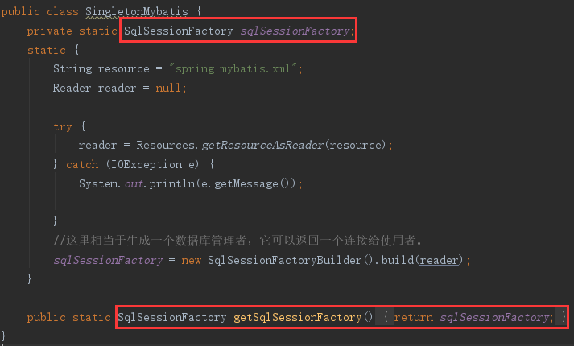

#### 2.2 **建造者模式**

建造者模式（Builder Pattern）使用多个简单的对象一步一步构建成一个复杂的对象。这种类型的设计模式属于创建型模式，它提供了一种创建对象的最佳方式。

一个 Builder 类会一步一步构造最终的对象。该 Builder 类是独立于其他对象的。

**应用：**

`system-design\backend\src\main\java\xyz\timoney\swsad\singleton\SingletonMybatis.java`

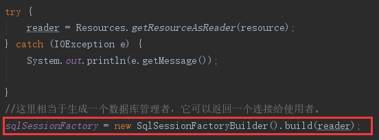

`system-design\backend\src\main\java\xyz\timoney\swsad\service\JwtHelper.java`

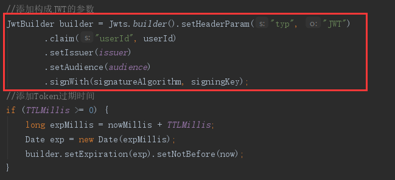

#### 2.3 **拦截过滤器模式**

拦截过滤器模式（Intercepting Filter Pattern）用于对应用程序的请求或响应做一些预处理/后处理。定义过滤器，并在把请求传给实际目标应用程序之前应用在请求上。过滤器可以做认证/授权/记录日志，或者跟踪请求，然后把请求传给相应的处理程序。

**应用：**

`system-design\backend\src\main\java\xyz\timoney\swsad\intercepter\CookieIntercepter.java`


#### 2.4 **数据访问对象模式**

数据访问对象模式（Data Access Object Pattern）或 DAO 模式用于把低级的数据访问 API 或操作从高级的业务服务中分离出来。以下是数据访问对象模式的参与者。

- **数据访问对象接口（Data Access Object Interface）** - 该接口定义了在一个模型对象上要执行的标准操作。
- **数据访问对象实体类（Data Access Object concrete class）** - 该类实现了上述的接口。该类负责从数据源获取数据，数据源可以是数据库，也可以是 xml，或者是其他的存储机制。
- **模型对象/数值对象（Model Object/Value Object）** - 该对象是简单的 POJO，包含了 get/set 方法来存储通过使用 DAO 类检索到的数据。

**应用：**

- 模型对象/数值对象

`system-design\backend\src\main\java\xyz\timoney\swsad\bean\user\User.java`

> ​		用结构图展示吧

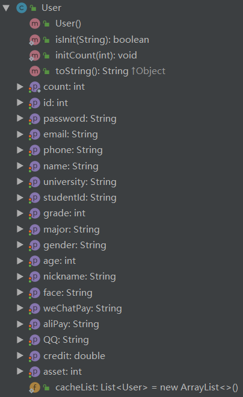

 - 数据访问对象接口

   `system-design\backend\src\main\java\xyz\timoney\swsad\mapper\UserMapper.java`

   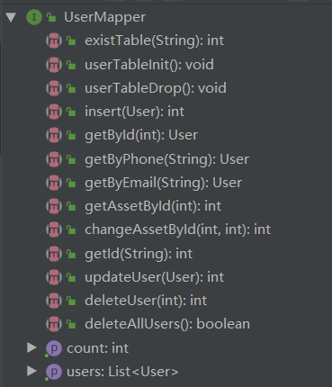

 - 数据访问对象实体类

   `system-design\backend\src\main\resources\mappers\userMapper.xml`

   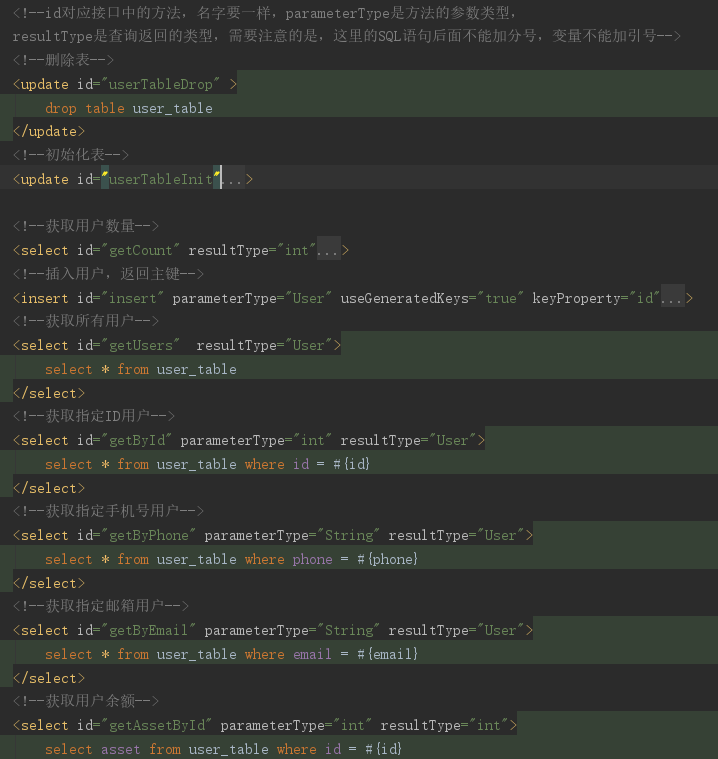

